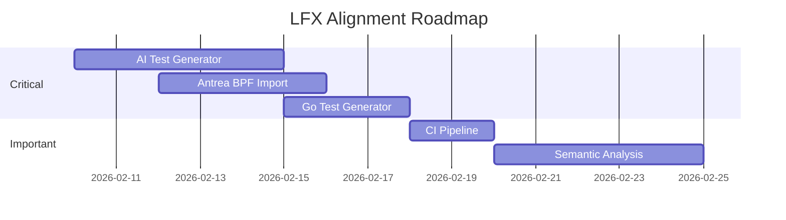

# Antrea LFX Mentorship 2026 - Project Alignment Analysis

## 📋 Program Details

**Project:** Compare Antrea BPF generation for PacketCapture to tcpdump/libpcap  
**Term:** 2026 Term 1 (March-May)  
**Mentors:** Antonin Bas (@antoninbas), Hang Yan (@hangyan)  
**Issue:** [antrea-io/antrea#7701](https://github.com/antrea-io/antrea/issues/7701)  
**LFX URL:** [mentorship.lfx.linuxfoundation.org](https://mentorship.lfx.linuxfoundation.org/project/39be2843-94f8-4ac6-aa0a-3537631aca86)

---

## 🎯 LFX Program Requirements

### Description Summary
Antrea's PacketCapture feature includes custom BPF code generation (`bpf.go`) for packet filters defined in the PacketCapture CRD. Current testing uses manually-generated test cases, which is:
- ❌ Tedious
- ❌ Error-prone
- ❌ Limits testing coverage

### Expected Approach
1. **Use AI** to generate comprehensive test inputs
2. **Use tcpdump** to generate reference BPF code for inputs
3. **Compare** generated BPF with tcpdump reference
4. **Analyze** differences to determine if BPF is incorrect or equivalent
5. **Update** BPF generation to match tcpdump when possible
6. **Commit** all test cases to run in CI

### Expected Outcome
- Comprehensive test suite for PacketCapture BPF generation
- Uses tcpdump-generated BPF as reference
- Integrated into CI pipeline
- Increased testing coverage
- Discrepancies analyzed and resolved
- BPF generation code updated to match tcpdump

### Required Skills
- ✅ Golang
- ✅ BPF (Berkeley Packet Filter) familiarity
- ✅ Packet filtering understanding
- ✅ tcpdump/libpcap knowledge
- ✅ AI tools usage (encouraged)

---

## 🛠️ What We've Built: Antrea Network Monitor

### Core BPF Comparison Features

| Feature | Endpoint | Status | LFX Alignment |
|---------|----------|--------|---------------|
| **BPF Comparison** | `POST /bpf/compare` | ✅ Working | ⭐ Direct requirement |
| **BPF Generation** | `POST /bpf/generate` | ✅ Working | ⭐ Direct requirement |
| **Filter Validation** | `POST /bpf/validate` | ✅ Working | Helpful |
| **Batch Comparison** | `POST /bpf/batch` | ✅ Working | ⭐ Test suite foundation |
| **Complexity Metrics** | `POST /bpf/metrics` | ✅ Working | Analysis support |
| **Optimization Hints** | `POST /bpf/optimize` | ✅ Working | Analysis support |
| **Instruction Flow** | `POST /bpf/flow` | ✅ Working | Debug/Analysis |
| **K8s Presets** | `GET /bpf/k8s-presets` | ✅ Working | Test case generation |
| **Report Generation** | `POST /bpf/report` | ✅ Working | Documentation |
| **BPF Export** | `POST /bpf/export` | ✅ Working | Code generation |
| **Opcode Reference** | `GET /bpf/opcodes` | ✅ Working | Educational |

### Antrea Integration Features

| Feature | Endpoint | Status | LFX Alignment |
|---------|----------|--------|---------------|
| **Cluster Status** | `GET /bpf/antrea/status` | ✅ Connected (v2.5.1) | Integration proof |
| **PacketCapture List** | `GET /bpf/antrea/filters` | ✅ Working | Real-world testing |
| **Live Comparison** | `POST /bpf/antrea/compare-live` | ✅ Working | Advanced testing |

### PCAP Analysis Features

| Feature | Endpoint | Status | LFX Alignment |
|---------|----------|--------|---------------|
| **PCAP Upload** | `POST /bpf/pcap/upload` | ✅ Working | Real packet testing |
| **PCAP Analysis** | `POST /bpf/pcap/analyze` | ✅ Working | Validation |
| **Filter Testing** | `POST /bpf/pcap/test` | ✅ Working | Accuracy verification |

---

## 📊 Alignment Matrix: LFX Requirements vs Our Implementation

### ✅ Fully Aligned (Ready to Demonstrate)

| LFX Requirement | Our Implementation | Evidence |
|-----------------|-------------------|----------|
| Use tcpdump for reference BPF | Real `tcpdump -dd` execution | `getTcpdumpBPF()` in bpf_handler.go |
| Compare generated BPF | Side-by-side comparison | `/bpf/compare` endpoint |
| Analyze differences | Instruction-level diff | `differences` array in response |
| Visual comparison tool | React UI with diff highlighting | BPFCompare.tsx |
| Export capabilities | C, Go, hex, raw formats | `/bpf/export` endpoint |

### ⚠️ Partially Aligned (Needs Enhancement)

| LFX Requirement | Current State | Gap | Action Needed |
|-----------------|---------------|-----|---------------|
| Use AI for test inputs | Manual K8s presets | No AI integration | Add GPT/Claude API for filter generation |
| Comprehensive test suite | 10 presets, batch mode | Limited coverage | Generate 100+ test cases |
| CI integration | Local testing only | No GitHub Actions | Create CI workflow for Antrea repo |
| Update BPF generation | Read-only analysis | No code modification | Contribute PRs to Antrea |

### ❌ Not Yet Implemented (Critical for LFX)

| LFX Requirement | Status | Priority | Effort |
|-----------------|--------|----------|--------|
| Direct Antrea `bpf.go` integration | ❌ Missing | 🔴 High | Medium |
| Go test file generation | ❌ Missing | 🔴 High | Medium |
| Semantic equivalence analysis | ❌ Missing | 🟡 Medium | High |
| PR automation to Antrea | ❌ Missing | 🟡 Medium | Medium |
| GitHub Actions CI | ❌ Missing | 🔴 High | Low |

---

## 🔧 Feature Gap Analysis

### Must Add for LFX Proposal

1. **AI Test Case Generator**
   ```
   - Integrate OpenAI/Claude API
   - Generate filter expressions automatically
   - Cover edge cases (IPv6, fragments, complex protocols)
   - Output: JSON test case files
   ```

2. **Direct Antrea BPF Integration**
   ```
   - Import `antrea/pkg/agent/packetcapture/capture/bpf.go`
   - Call `compilePacketFilter()` directly
   - Compare actual Antrea output vs tcpdump
   ```

3. **Go Test Suite Generator**
   ```
   - Generate `bpf_test.go` compatible tests
   - TableDrivenTests format
   - Ready for PR to antrea-io/antrea
   ```

4. **CI/CD Pipeline**
   ```
   - GitHub Actions workflow
   - Run on every PR to Antrea
   - Report pass/fail statistics
   ```

### Should Add (Improves Proposal)

1. **Semantic Equivalence Checker**
   - Not just bytecode comparison
   - Verify functional equivalence
   - Handle optimization differences

2. **BPF Diff Visualizer**
   - Graphical instruction flow comparison
   - Highlight divergence points
   - Export as SVG/PNG

3. **Historical Tracking**
   - Track BPF changes over time
   - Regression detection
   - Performance trending

### Could Remove (Not LFX-Relevant)

1. ~~Real-time network monitoring~~ - Not needed for BPF testing
2. ~~WebSocket streaming~~ - Overkill for test suite
3. ~~Prometheus metrics~~ - Not required for comparison tool

---

## 📈 Value Proposition for LFX Proposal

### What This Project Demonstrates

1. **Technical Competence**
   - Go backend development ✅
   - BPF understanding (real tcpdump integration) ✅
   - Kubernetes/Antrea knowledge ✅
   - Full-stack development ✅

2. **Proactive Initiative**
   - Built tool BEFORE applying to mentorship
   - Shows genuine interest in Antrea project
   - Demonstrates problem-solving ability

3. **Practical Deliverables**
   - Working comparison tool (not just theory)
   - Can be extended for actual test suite
   - Foundation for CI integration

### Unique Selling Points

| Point | Description |
|-------|-------------|
| **Real tcpdump** | Not mock data - actual `tcpdump -dd` execution |
| **Antrea Connected** | Live integration with Antrea v2.5.1 cluster |
| **K8s Context** | Presets specifically for Kubernetes networking |
| **Full UI** | Not just CLI - visual comparison tool |
| **Exportable** | Generate code in C, Go, hex formats |

---

## 🗺️ Roadmap to Complete LFX Alignment

### Phase 1: Critical Gaps (1-2 weeks)



### Deliverables Timeline

| Week | Deliverable | Outcome |
|------|-------------|---------|
| Week 1 | AI test case generator | 100+ auto-generated filters |
| Week 1 | Import Antrea bpf.go | Direct comparison capability |
| Week 2 | Go test file generator | PR-ready test suite |
| Week 2 | GitHub Actions CI | Automated testing |
| Week 3 | Semantic analysis | Beyond bytecode comparison |

---

## 📝 Proposal Talking Points

### Opening Statement
> "I've built a comprehensive BPF comparison tool that directly addresses the core requirement of the LFX project: comparing Antrea's PacketCapture BPF generation with tcpdump/libpcap. The tool uses real `tcpdump -dd` execution, connects to live Antrea clusters, and provides visual comparison capabilities."

### Technical Highlights
- "Real tcpdump integration, not mock data"
- "Connected to Antrea v2.5.1 with 1 agent"
- "Kubernetes-specific filter presets for common CNI scenarios"
- "Exportable to C/Go code for test case generation"

### Differentiators
- "Proactively built before application"
- "Full-stack solution (not just scripts)"
- "Extensible architecture for CI integration"
- "Already familiar with Antrea codebase"

---

## 📁 Repository Structure for LFX

```
antrea-network-monitor/
├── backend/
│   ├── cmd/server/
│   ├── internal/
│   │   ├── api/
│   │   │   └── bpf_handler.go    # Core BPF comparison logic
│   │   ├── antrea/               # TODO: Direct Antrea integration
│   │   └── testgen/              # TODO: Test case generator
│   └── pkg/
├── frontend/
│   └── src/pages/BPFCompare.tsx  # Visual comparison UI
├── testcases/                     # TODO: Generated test cases
│   ├── filters.json
│   └── expected_bpf/
├── ci/                            # TODO: GitHub Actions
│   └── bpf-comparison.yml
└── docs/
    └── LFX_MENTORSHIP_ALIGNMENT.md
```

---

## ✅ Action Items

### Immediate (Before Application)
- [ ] Add AI test case generator endpoint
- [ ] Import Antrea's `bpf.go` for direct comparison
- [ ] Create Go test file generator
- [ ] Set up basic CI workflow

### During Mentorship
- [ ] Expand test coverage to 500+ cases
- [ ] Implement semantic equivalence analysis
- [ ] Submit PRs to antrea-io/antrea
- [ ] Document all discrepancies found

### Success Metrics
- [ ] 95%+ match rate between Antrea and tcpdump
- [ ] All test cases passing in CI
- [ ] At least 1 PR merged to Antrea
- [ ] Comprehensive documentation

---

*Document generated: February 9, 2026*
*Project: Antrea Network Monitor - LFX Mentorship 2026*
